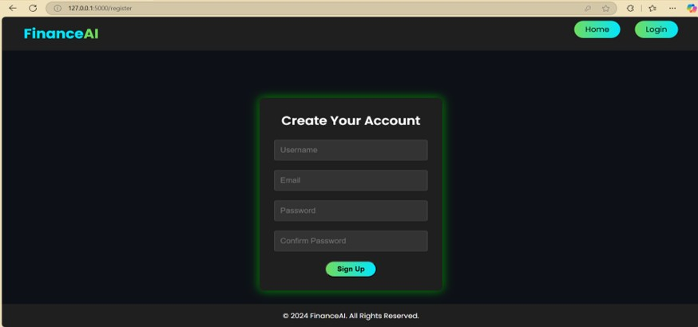
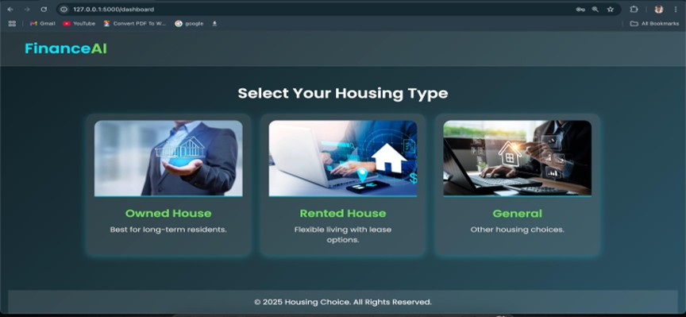
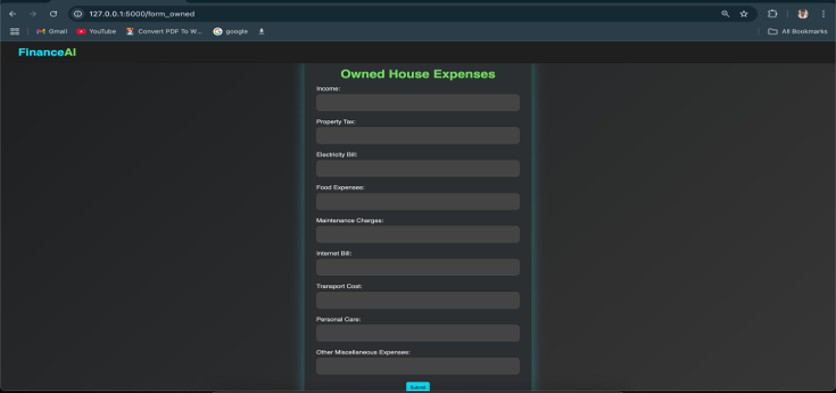
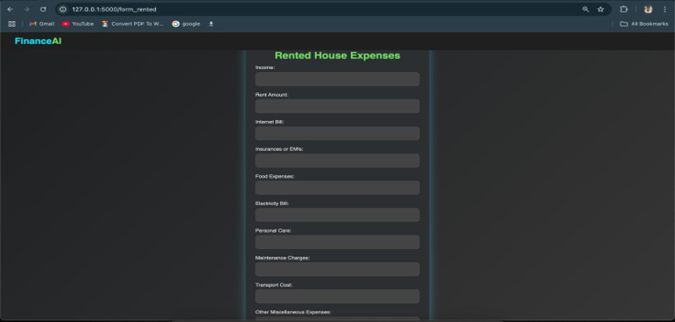
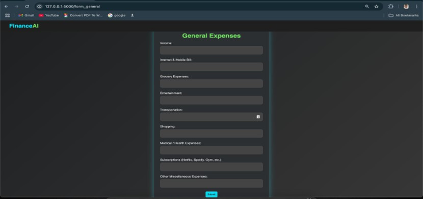

# 💸 Personal Finance Manager with AI-Powered Budgeting

A smart web application that helps users manage their monthly expenses more efficiently. Based on housing type and expense details, it classifies the spender type (Low, Medium, High) using a machine learning model and offers AI-generated suggestions using the Gemini API.

---

## 🚀 Features

- 🏡 House-Type Based Inputs:
  - Owned House
  - Rented House
  - General Expenses

- 📊 Intelligent Classification:
  - Uses a trained SVM model to classify users as **Low**, **Medium**, or **High Spenders** based on inputs

- 🤖 Gemini AI Integration:
  - Once spender type is predicted, AI provides personalized budgeting tips and insights

- 🖥️ Real-Time User Interface:
  - Clean and responsive form-based web UI

---

## 🛠️ Tech Stack

- **Frontend:** HTML, CSS, JavaScript
- **Backend:** Flask (Python)
- **Machine Learning:** Scikit-learn (SVM)
- **AI Assistant:** Gemini API
- **Database (Optional):** MySQL

---

## Screenshots
## WEB INTERFACE

## REGISTER PAGE

## LOGIN PAGE

## HOUSEING TYPE

## OWN HOUSE FORM

## RENTEND HOUSE FORM

## GENERAL FORM

## LOW SPENDER TYPE

## AI GIVE THE SUGGESTION FOR LOW SPENDER

## MEDIUM SPENDER TYPE

## AI GIVE THE SUGGESTION FOR MEDIUM SPENDER

## HIGH SPENDER TYPE

## AI GIVE THE SUGGESTION FOR HIGH SPENDER

======================
## 🧪 Setup Instructions

1. Clone the Repository:

   ```bash
   git clone https://github.com/yourusername/personal-finance-ai.git
   cd personal-finance-ai
